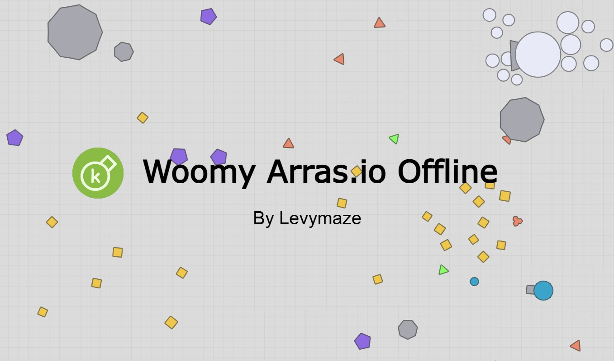

# Woomy-Arras Offline — Modded Edition

  

  A Modded version of the 2d-tank shooting game Woomy-arras.io Offline.

---

> [!IMPORTANT]
> I do **not** own the original Woomy-Arras codebase. This repository contains my own modifications.
>
> Many of the additions found in this version were created in response to community requests and gameplay experimentation. Some content has never existed in the original Woomy-Arras project and may not reflect its original design philosophy.
>
> I am **not affiliated** with Drako Hyena or any of the developers behind Woomy-Arras. Consider this project a **fan-made continuation and experimentation branch**.

##  What Has Been Added

###  Additional Gamemodes

Several Growth-based and hybrid gamemodes have been added or restored.

#### Included Modes

- Growth FFA (Reintroduced)
- Growth 2TDM
- Growth 4TDM
- Growth 4TDM Maze
- Growth Maze FFA
- Growth Siege
- Growth Solo vs Team
- Various additional Growth hybrids and experimental modes

> More gamemodes may be added in future updates.

---

###  Testing & Sandbox Tools

A large collection of testing utilities has been added for developers, hosts, and sandbox gameplay.

#### Available Features

- Spawn bosses
- Spawn polygons
- Adjust bot counts
- Adjust polygon counts
- Edit player skills
- Edit score values
- Edit map obstacles
- Configure testing environments
- And much more

> [!NOTE]
> These tools are primarily intended for development, balancing, debugging, and sandbox testing.

---

###  New Developer Keybinds

> Requires a valid Developer Token.

| Key | Action |
|------|---------|
| `I` | Increase entity score |
| `U` | Decrease entity score |
| `H` | Fully heal an entity |
| `Q` | Instant teleport with temporary immunity |
| `+` | Increase field of view |
| `-` | Decrease field of view |
| `V` | Create walls |
| `T` | Change teams |

### Previously existing Developer Keybinds

| Key | Action |
|------|---------|
| `F` | Spawn squares |
| `K` | Self destruct |
| `Z` | Hold and drag entity |
| `P` | Change own tank to basic |
| `X` | Passive mode |
| `J` | Invisibilty |
| `B` | Change Colors |
|  `  | Change to developer tank |

Additional developer shortcuts are also available.

---

###  Tank Additions

New tanks and experimental branches have been introduced, including:

- `Wrench`
- `Spanner`
- `Crowbar`
- `Top Banana`
- `Ultra Spawner`
- `Mega Spawner`
- `Headman`
- `Bigger Cheese`
- `Big Mac`

...and many more.

---

###  Balancing, Fixes & Optimizations

Numerous gameplay and backend improvements have been made throughout the project.

#### Highlights

- Rebalanced multiple tanks
- Fixed Conqueror branch bots being unable to fire
- Added Growth bullet physics
- Optimized game files and resource loading
- Various bug fixes and code cleanups
- General balance adjustments and oversight corrections

> [!TIP]
> Original code has been Optimized, Seperated and even minfied at some points. Only write code if you know how it works. AI's can damage server logic, use them  at your own risk. It is advised to commit or make back up copies of your progress if you modify this codebase.
>
>

---

## Ongoing Development

This project remains under active development.

More than **13 unreleased features** have already been implemented and are intentionally not documented here yet. Additional content, balancing changes, gamemodes, and developer tools may continue to be added over time.

> This project is no longer open sourced
